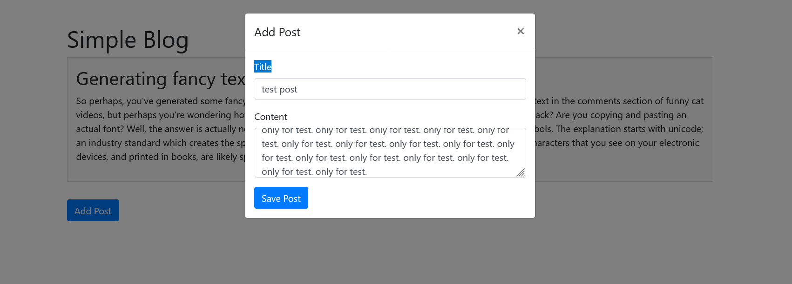

# Simple Blog Platform
A basic blogging platform where users can post, edit, and delete articles. Built using PHP, HTML, jQuery, AJAX, JSON, Bootstrap, CSS, and MySQL.

**Topics:** `php`, `mysql`, `blog`, `ajax`, `bootstrap`, `jquery`, `css`



### Install Process

1. **Clone the Repository:**
   ```sh
   git clone https://github.com/yourusername/simple-blog-platform.git
   cd simple-blog-platform
   ```

2. **Set Up the Database:**
    - Create a MySQL database named `blog_db`.
      Import the provided SQL file (`db/database.sql`) to set up the necessary tables.
    - Import the provided SQL file to set up the necessary tables.
    ```sh
      mysql -u yourusername -p blog_db < db/database.sql
    ```

3. **Configure Database Connection:**
    - Copy `config.sample.php` to `config.php`:
      ```sh
      cp config.sample.php config.php
      ```
    - Open `config.php` and update the database configuration details.

4. **Run the application:**
    - Serve the application using your local web server or PHP's built-in server:
      ```sh
      php -S localhost:8000
      ```

5. **Access the application:**
    - Open your browser and navigate to `http://localhost:8000`.


### File Structure

Here’s a basic file structure for your simple-blog-platform application:

```
simple-blog-platform/
│
├── config.sample.php
├── index.html
├── db/
│   └── database.sql
├── src/
│   ├── get-post.php
│   └── post-handler.php
├── include/
│   ├── config.sample.php
│   └── db.php
├── assets/
│   ├── css/
│   │   └── style.css
│   ├── js/
│   │   └── script.js
│   └── images/
├── README.md
└── .gitignore
